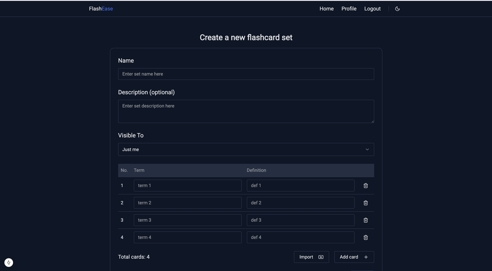

# Summary

**FlashEase** is a Quizlet-inspired flashcard learning application designed to help students and learners study efficiently. Built with [Next.js](https://nextjs.org/) for the frontend and [NestJS](https://nestjs.com/) for the backend, FlashEase offers a modern, responsive, and user-friendly experience for creating, managing, and studying flashcards. Whether you're preparing for exams or learning a new language, FlashEase makes studying engaging and effective.

# Demo images





# ✅ Checklist

- [x] Sign in & sign up via email.
- [x] OAuth2 (Google).
- [x] Admin & User roles.
- [x] Pagination: Offset.
- [x] File upload (single and multiple): Using AWS S3 and Cloudfront service.
- [x] Docker support: Docker compose and Dockerfile for development & production.
- [x] CI: Github action.
- [x] Database support: [TypeORM](https://www.npmjs.com/package/typeorm).
- [x] Seeding: [Typeorm Extension](https://www.npmjs.com/package/typeorm-extension).
- [x] Config service: [@nestjs/config](https://docs.nestjs.com/techniques/configuration).
- [x] API Documentation (Swagger): Using NestJS cli plugin [@nestjs/openapi](https://docs.nestjs.com/openapi/cli-plugin).
- [x] Format & Lint: [Prettier](https://www.npmjs.com/package/prettier) & [ESLint](https://www.npmjs.com/package/eslint)
- [ ] Mailing ([@nestjs-modules/mailer](https://www.npmjs.com/package/@nestjs-modules/mailer) & [nodemailer](https://www.npmjs.com/package/nodemailer)).
- [ ] E2E and units tests.
- [ ] Internationalization/Translations (I18N) ([nestjs-i18n](https://www.npmjs.com/package/nestjs-i18n)).

# ✨ Features

- **Create and Manage Flashcards**: Easily create, edit, and organize flashcard sets for any subject.
- **Study Modes**: Practice with interactive modes: flashcard, learn (multiple-choices question), and test (fill-in questions
  ) mode.
- **Share**: Share with others community or people you want.
- **Responsive Design**: Optimized for both mobile and desktop devices using Tailwind CSS.
- **User Profiles**: Manage your account, track progress, and customize your learning experience.
- **Form Validation**: Robust form handling with React Hook Form and Zod for creating flashcard sets.
- **Modern UI**: Accessible and customizable components powered by Shadcn UI.
- **Dark/Light Mode**: Theme support with `next-themes` for comfortable studying at any time.

# 🚀 Running the app

## Prerequisites

- [Node.js](https://nodejs.org/) (v20 or higher)
- [pnpm](https://pnpm.io/) (v10.4.1 or higher)
- [Docker](https://www.docker.com/) and [Docker Compose](https://docs.docker.com/compose/)

## Installation

### Client side

1. **Clone the repository and install dependencies**:

   ```bash
   git clone https://github.com/hungpn23/flashease_client.git
   cd flashease_client
   pnpm install
   ```

2. **Build and run the application**:

   ```bash
   docker network create flashease
   docker compose -f compose.local.yml up --build
   ```

3. **Access the application**:
   Open http://localhost in your browser to access the app via Nginx.

   The Nginx proxy routes requests to the Next.js frontend (http://client:3000).
   API requests to /api/v1/ will be proxied to the NestJS backend (if running on server:3001).

### Server side

1. **Clone the repository and install dependencies**:

   ```bash
   git clone https://github.com/hungpn23/flashease_server.git
   cd flashease_server
   cp .env.example .env.development
   pnpm install
   ```

- ✅ Make sure you have filled in all the variables in .env.development and .env.seeding

2. **Build and run the application**:

   ```bash
   docker compose -f compose.local.yml --env-file .env.development up -d --build
   ```

3. **Access the application**:
   Open http://localhost in your browser to access the app via Nginx.

   The Nginx proxy routes requests to the Next.js frontend (http://client:3000).
   API requests to /api/v1/ will be proxied to the NestJS backend (if running on server:3001).

4. **Access the api documentation**:
   visit http://localhost/api-docs with username: admin & password: admin

## References

- [vndevteam](https://github.com/vndevteam/nestjs-boilerplate)
